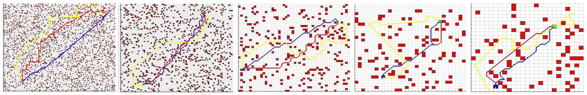
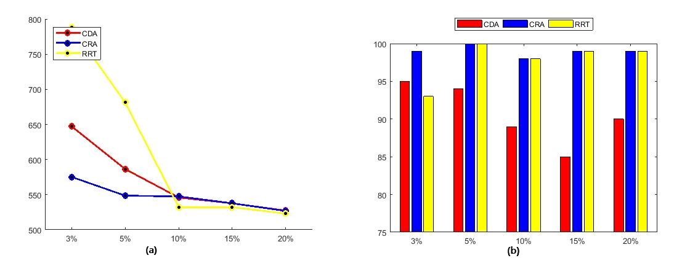
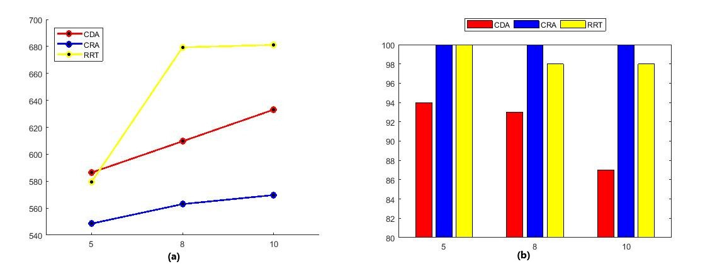
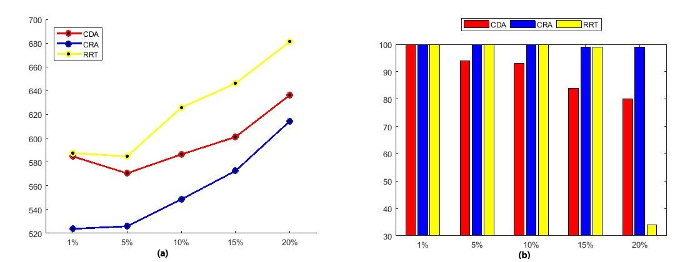
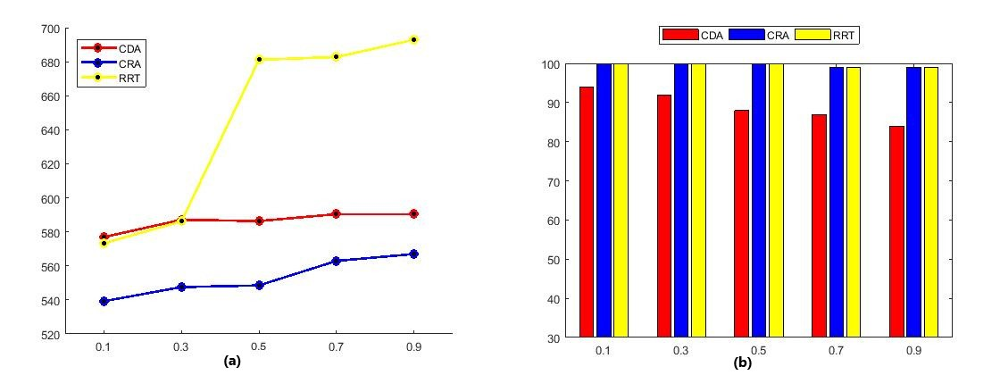

#  Efficient Path Planning for Non-Holonomic Vehicles in the Presence of Environmental Disturbances

Developed Control based A* (CBA*) star Algorithm for Non- Holanomic vehicles namely Dubins Car and Reed-Sheep Car with environment disturbances.Ran Over 100 simulations with varying each parameter like obstacle density , vehicle velocity , grid resolution and wind
velocity .Used Nonlinear Guidance Law as path following controller for converting gridded to clustered environment.Compared our algorithm with kinodynamic RRT* algorithm with the same constraints for path cost, success rate and computation time.

Following images show various simulation path results for variation in grid resolution ,velocity of vehicle, changes in obstacle density and velocity of wind for 3 different algorithms 
CDA --Control Based A* for Dubins Car
CRA =-Control Based A* for Reed Sheep Car
RRT -- Rapidly exploring random tree algorithm 

